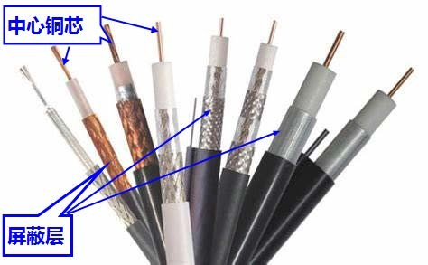
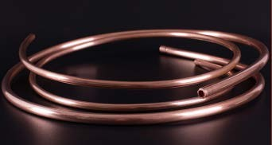
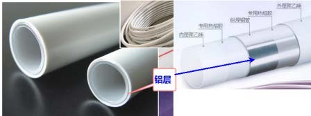
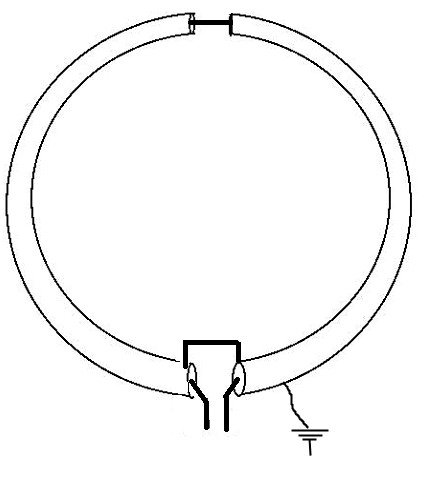
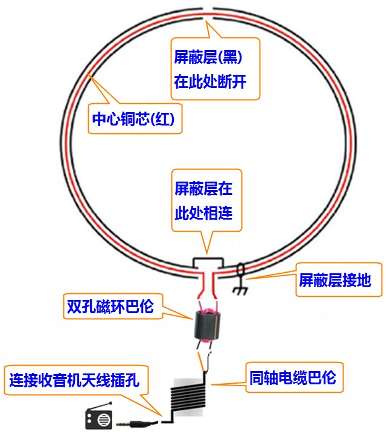
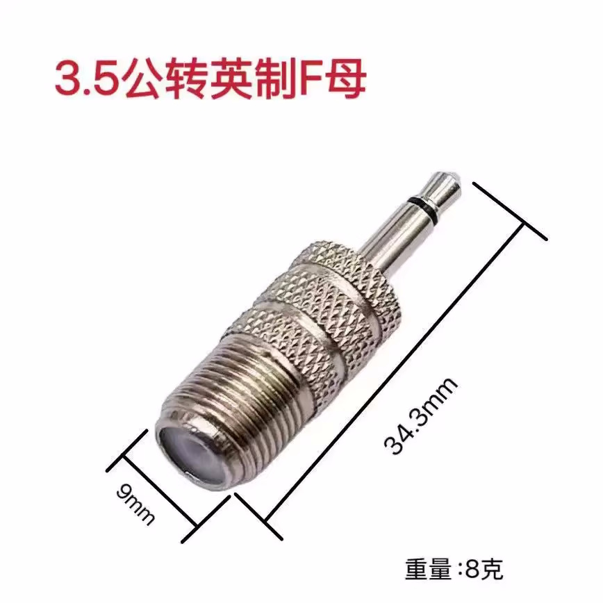
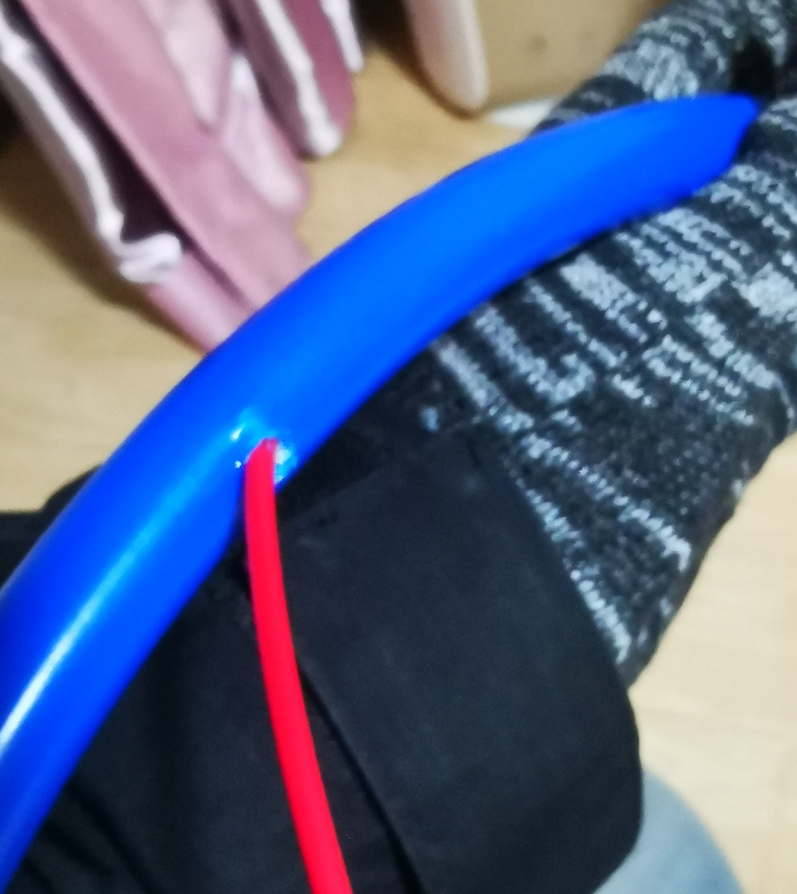
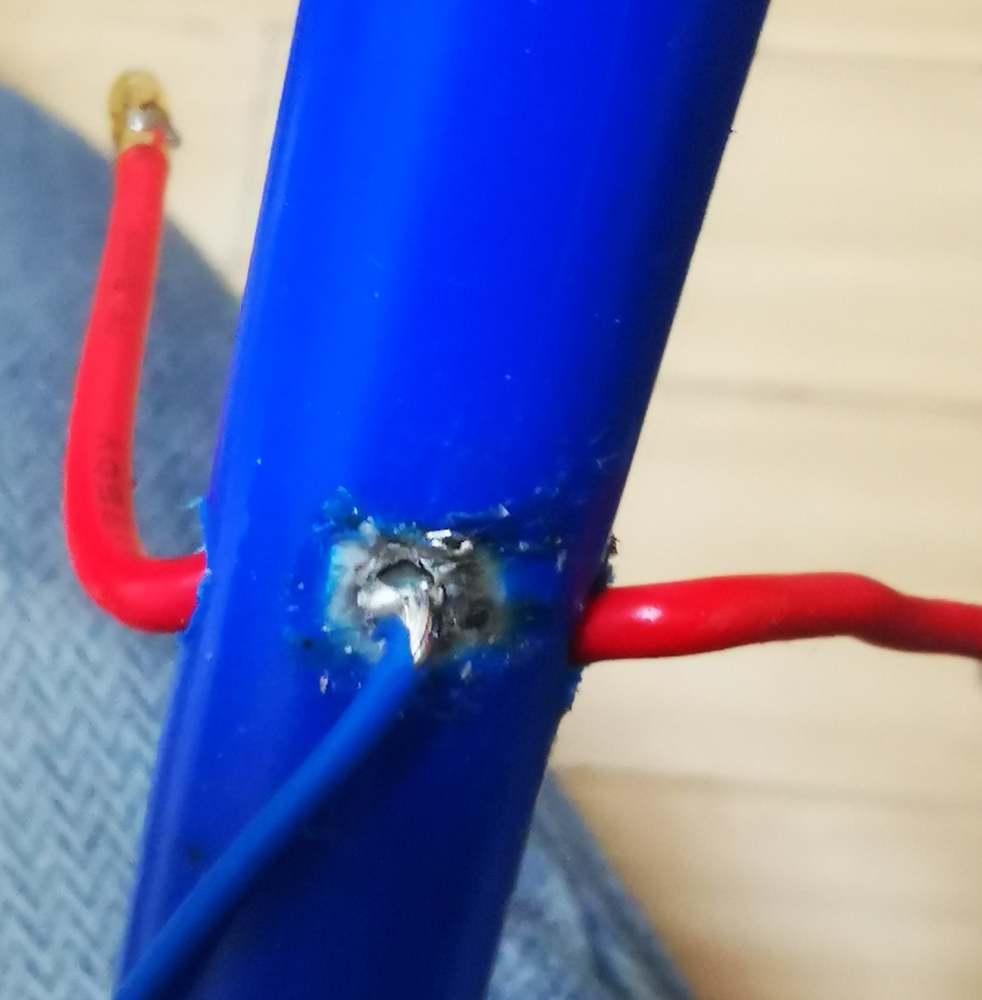
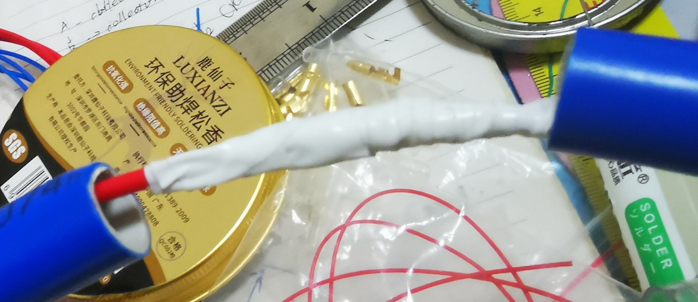
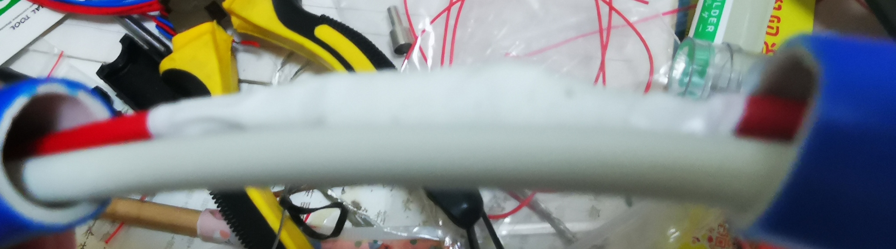

# 自制无源屏蔽环天线
前些日在网上无意中看到一篇自制收音机天线的文章，觉得步骤比较简单，于是决定自己动手制作一个。
## 1. 原理
这篇教程的内容是说无源屏蔽环的，用于制作这种环形天线的材质有好多，铜管、馈管、同轴电缆、铝塑水管、天然气软管等，任何带金属层易弯折的管材均可。

图 1.1 同轴电缆

图 1.2 铜管

图 1.3 铝塑管

制作的电路示意图也比较简单，整个圆环中包含内外两层导体，外层是屏蔽层，中心是导线，两层导体之间不相互接触，中心导体接馈线。中心导体会形成一个完整闭合回路，`信号 → 中心导体 → 绕一圈 → 回到馈点`。根据法拉第电磁感应定律，变化的磁场会产生感应电动势，从而在导体中产生电流。因此，当信号通过中心导体时，会在圆环中产生感应电流，从而形成一个闭合回路。

设计屏蔽层的目的是阻挡电场干扰，只响应磁场分量。所以这种结构抗电场干扰能力强，抗噪声性能好。在制作的过程中一定要注意屏蔽层要断开，如果屏蔽层不断开，屏蔽层也是一个闭合环，会形成“短路匝”，感应电流在屏蔽层流动，抵消中心导体中的信号，结果就是天线几乎没有输出。因此必须在顶部切断屏蔽层。

此天线“小环天线”，而小环天线只在“尺寸远小于波长”时才工作在理想磁场模式。一般要求 `周长<λ/10`。

假设你的环直径 30 cm, 则 `周长 ≈ 0.94 m`,在中波（1 MHz）下，波长 `λ = 300 m`，所以你的环非常小（≈ λ/320）。

在短波（10 MHz）下，波长 `λ = 30 m`，所以你的环仍然属于小环范围（≈ λ/32）。

在 FM（88-108 MHz）下，波长 `λ = 3.41 m`，小环的作用已经不明显（≈ λ/3），无法适用于此频段。

小环天线的辐射电阻：

$$
R_r \propto (面积 / λ²)^2
$$

注意是：`λ⁴`

这意味着：

* 频率越低
* λ越大
* 辐射电阻极小
* 天线本身几乎不辐射

这在接收时是优点：

- 不容易拾取远处电场噪声
- 更像磁场探头
- 本地抗干扰能力强

但在高频时：

* 辐射电阻迅速变大
* 它开始“像正常天线”
* 失去磁环特性

图 1.4 电路图

## 2. 材料准备

网上教程一般选择使用同轴电缆来制作此天线，但是由于同轴电缆不好塑性，所以我选择使用铝塑管来制作, 长度只用了 1m。中心导体我就选择了 1.5 平的电线。

图 2.1 带巴伦的电路图

为何更好的匹配阻抗我们还需要制作一个巴伦，所以这里选择了 BN-43-202 磁环来绕制巴伦。绕制的线圈选择了 0.2 平特氟龙镀银铜软线。

馈线使用了 75-5 的同轴电缆。由于我的收音机的天线接口是 3.5mm 的，所以还需要一个 3.5mm 转 75-5 的转接头。

图 2.2 3.5mm 转 75-5 的转接头

同时我们还需使用电烙铁进行焊接操作。

## 3. 制作过程
为了制作简单，直接将买回的铝塑管弯折成一圈，管子的前后两端作为开口位置，然后用电钻在管子中间位置的上下两处打孔。取两段导线分别穿过上下打孔位置，两条导线最终会在开头处汇合，接着将导体外皮拨开在汇合处焊接在一起。打孔是为了更好的屏蔽效果，孔越小屏蔽效果越好。所以这里孔的大小稍微大于导线直径，保证导线能正常穿过即可，我这里选择了使用 3mm 的钻头来打孔。

图 3.1 打孔并穿线

屏蔽层还需要接地，但是铝塑管采取的是铝制材料，对于焊接不是很友好，所以这边直接放弃了焊接的方式，将外面绝缘层剥开，然后刺穿铝塑管，将导线插入到铝塑管中，最后用胶带将地线导线和铝塑管绝缘层包裹住，让地线充分接触铝塑管的金属层。

图 3.2 地线处理

为了方便开口处的两根导线的焊接，可以用细铜丝将两根导线缠绕起来，再在上面缠上焊锡丝进行焊接，这样焊接过程中不会出现导线贴合不紧密的情况。焊接完成后，将焊接处用电工胶带包裹住，为了防止变形，可以在管子开口处塞入一节 PVC 管，然后在整体用电工胶带包裹住 PVC 管和导线。如果 PVC 管没有也可以用一些硬纸将导线包裹一下，再缠上胶带。

图 3.3 导线焊接好后缠上绝缘胶带

图 3.4 导线焊接好后塞入 PVC 管

巴伦采用 1:4 巴伦，制作方法可以参考之前的文章《[如何制作 1:4 巴伦](https://www.hamuniverse.com/kb1lqc41balun.html)》。后面查了一下资料，其实使用 1：1 巴伦即可。中波段很多是高阻输入，不需要做阻抗变换，重点是抑制共模电流。

最后将各个零部件按照图 2.1 的电路图进行组装起来。

