# 澳柯玛立式加热器不通电：拆机与更换底座微动开关

家里的澳柯玛立式加热器用了一年多，某天打开后不通电。想着大概率是机械开关或接插件类的小毛病，决定先自己拆开排查，能修则修。

## 机型与铭牌

整机为塔式结构，正面格栅、顶部旋钮调档。铭牌显示：**室内加热器**，型号 **NF22X012**，额定 **220V~ / 50Hz / 2200W**，制造商为青岛澳柯玛生活电器有限公司。下文拆机均应在**完全断电**、插头拔下的前提下进行。

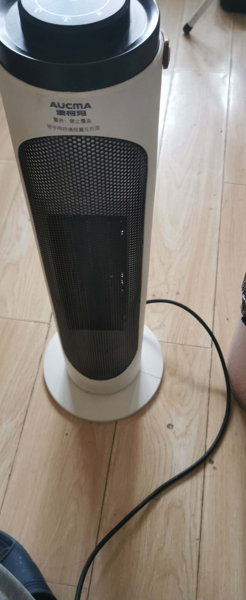

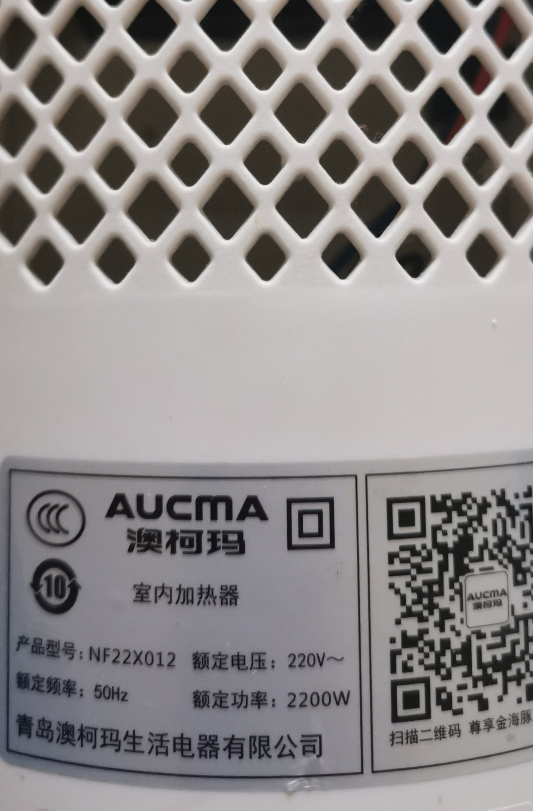

## 从底部开始拆

塔式加热器很多线束与控制件集中在底部。先把机器放倒或侧放，从**圆形底座**下手：取下底盖后，可见一圈固定螺钉；按顺序拧下，注意螺纹规格相近，可集中摆放以免混用。

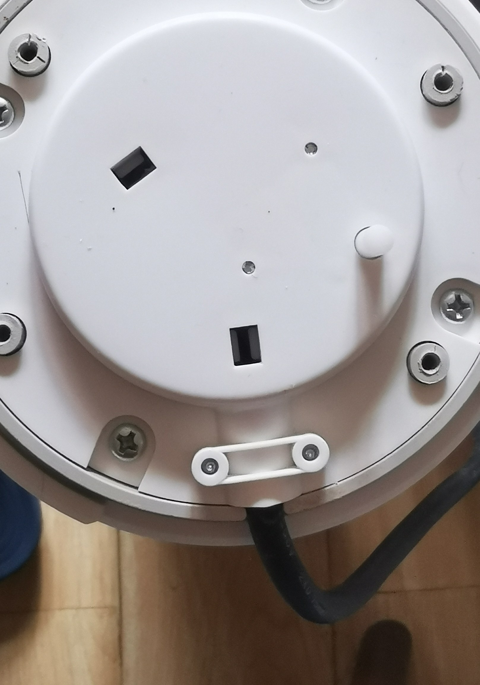

卸掉底盖及内层盖板后，电源线由压线扣固定在塑料座上，内部可见蓝、棕等电源线与编织护套线束。**拆开时建议拍照记录线色与走向**，回装时不易接反或漏接。

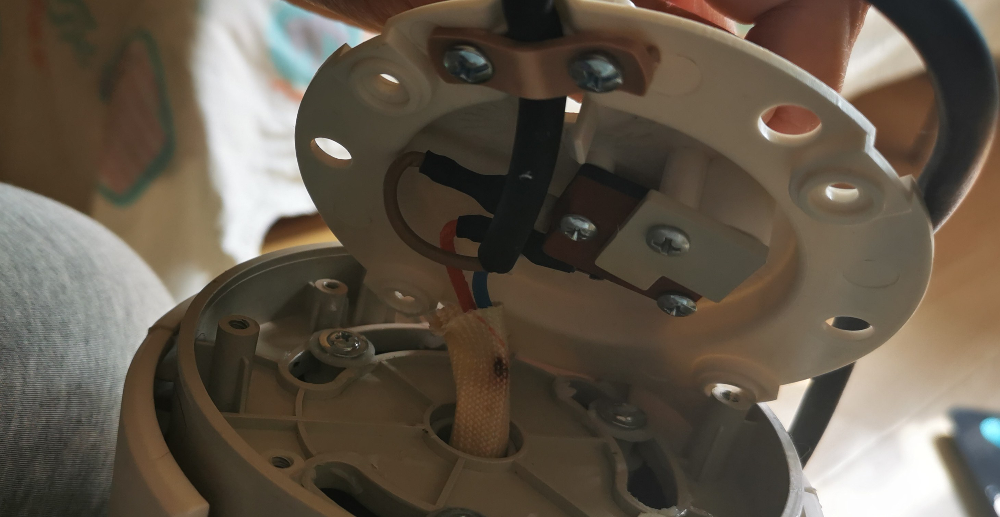

再往里能看到固定在底座塑料架上的**微动开关组件**（早期为红色外壳款，带按压柄），周围有多颗自攻螺钉与支撑柱。若仅怀疑开关，也可先只拆到这一层做通断测试。

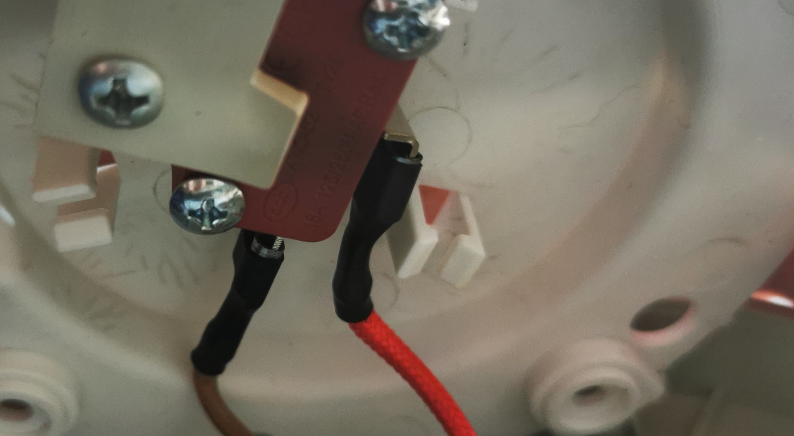

## 继续拆开塔身，排除其它故障

为确认问题不仅出在底座开关，又沿机身接缝用塑料撬片**慢慢**撬开外壳卡扣，避免划伤面板。打开后可看到上部同步电机、中部两组轴流风扇、下部一块开关电源类小板，线束多用扎带固定在壳体上。

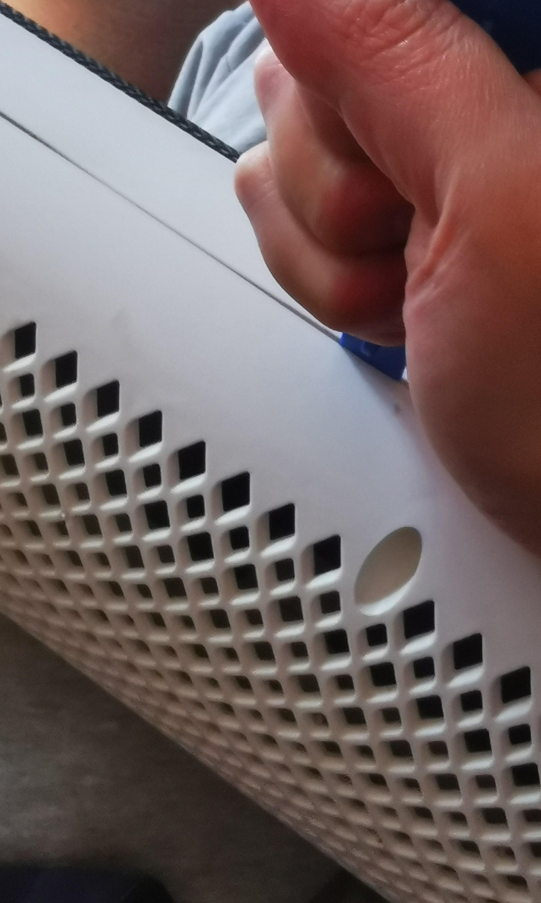

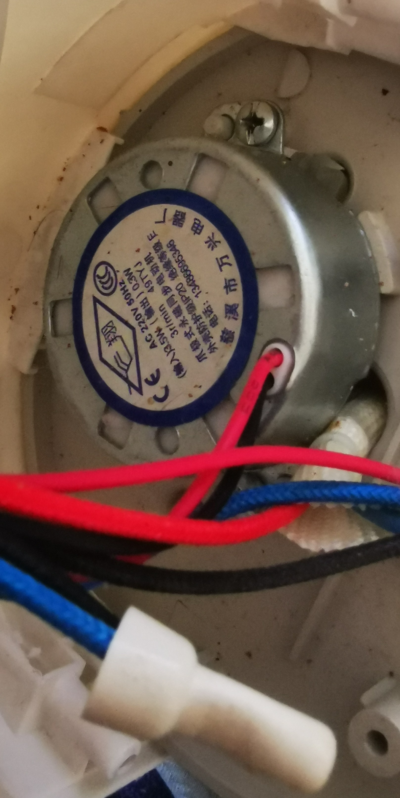

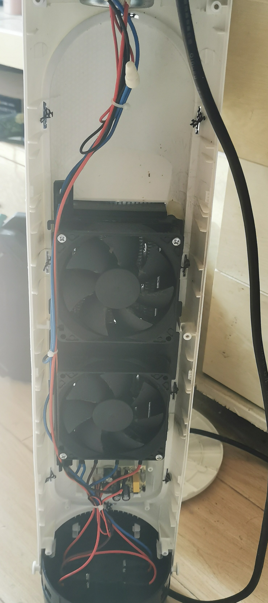

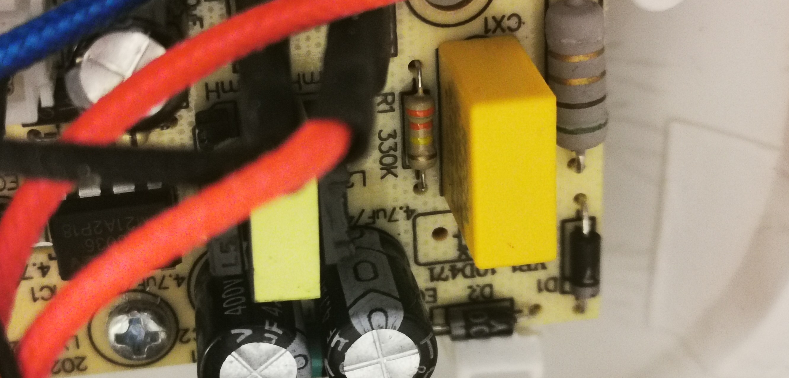

拆下的螺钉按长度、粗细分开放，回装更省事。

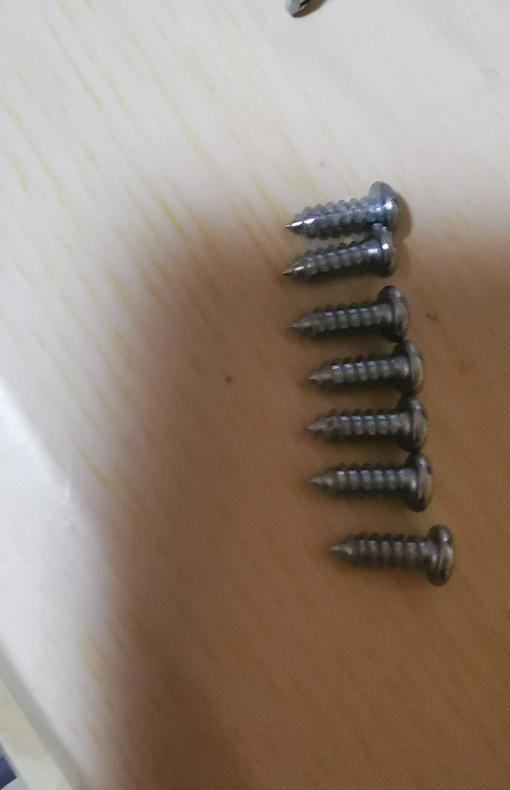

## 故障现象与旧开关

将原微动开关拆下，发现凸起的按钮部分已经没有弹性了，估计是里面的弹簧断了。用万用表测试，按钮必须用力按下后才能导通。

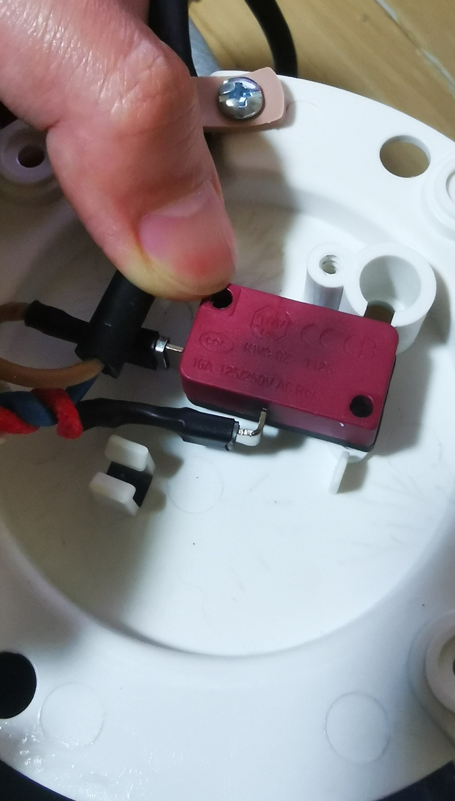

拆的时候由于不懂这个接线端子如何打开，愣是无法撤下线头，所以把热缩管部分拆开来看了一下，发现里面有一个卡扣，需要按一下，才能拆开。

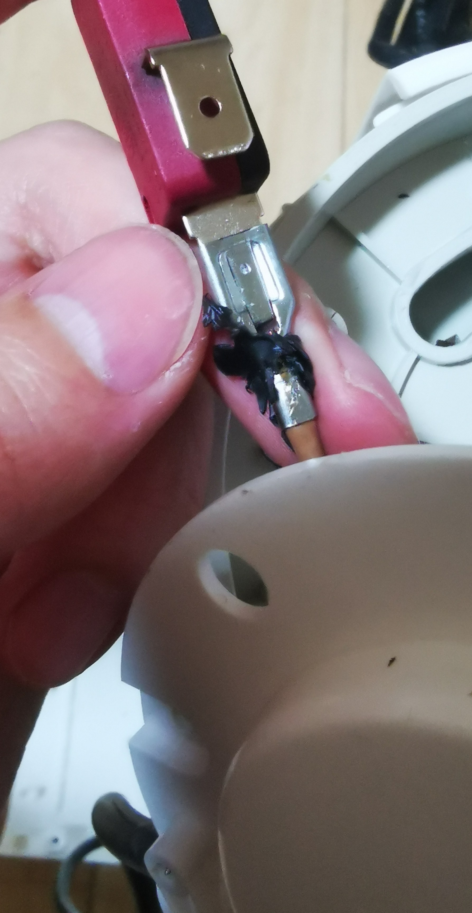

## 更换新开关与接线

从淘宝上购买了大小形状一样的开关，本来可以很快就能维修的，结果第一次店家发错货了，让他重新补发，补发也等了两天才发出，看来你想买便宜的东西，你的付出未必是节省的。

购入规格匹配的新微动开关后，按原线序焊接或插接，接头处用热缩管或绝缘胶带做好绝缘；固定螺钉拧紧，确认按压柄未被外壳顶住。装回底座前再次确认**无裸露铜线、无短路相碰**。

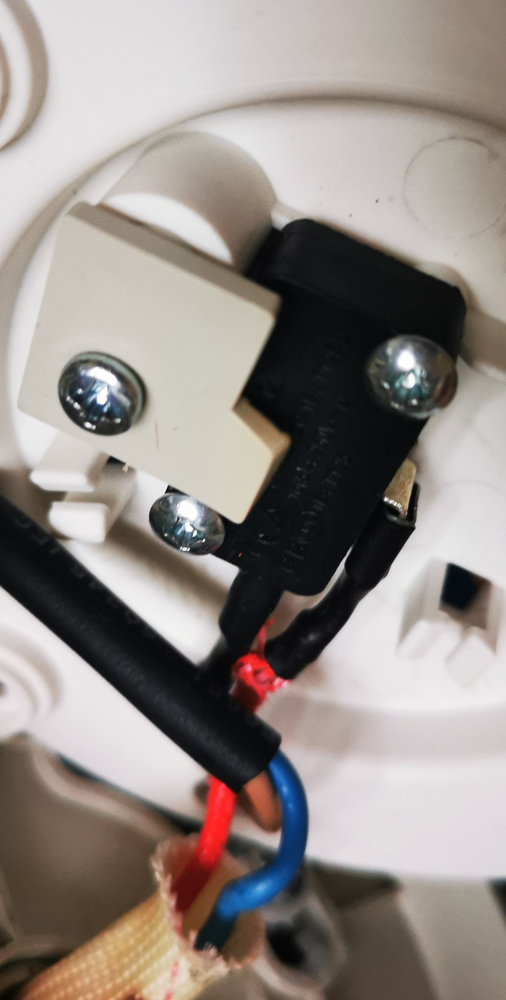

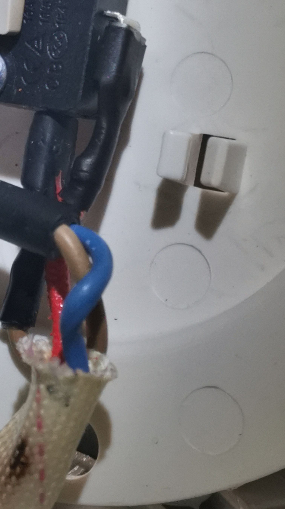

重新安装好，没有想到其复活了！

## 小结与选购提醒

- 全程断电操作；2200W 大功率，线材与接头压接要牢靠，避免虚接发热。
- 开关的对角线的螺丝用的是细螺丝，跟其他螺丝形状不同，要区分开。

