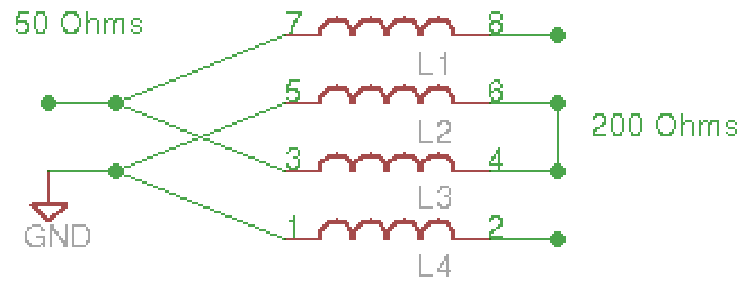
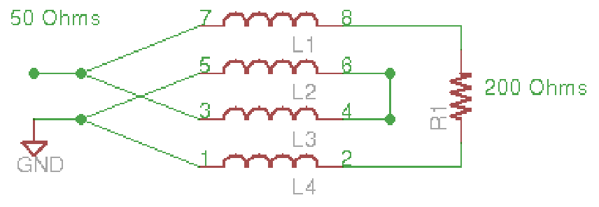
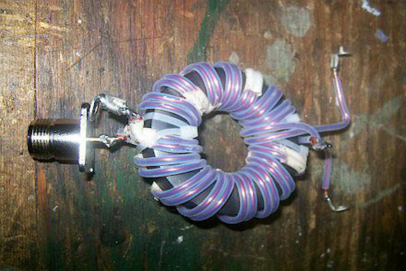
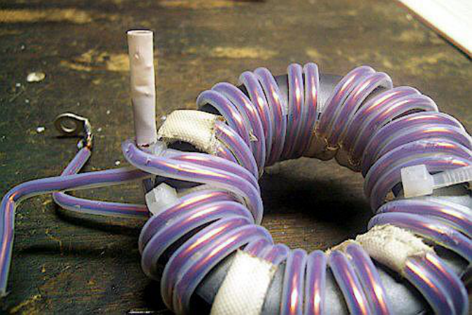
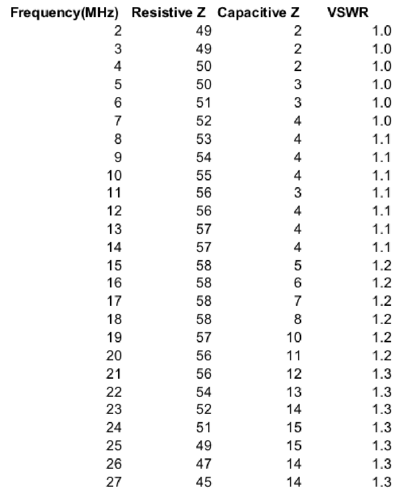
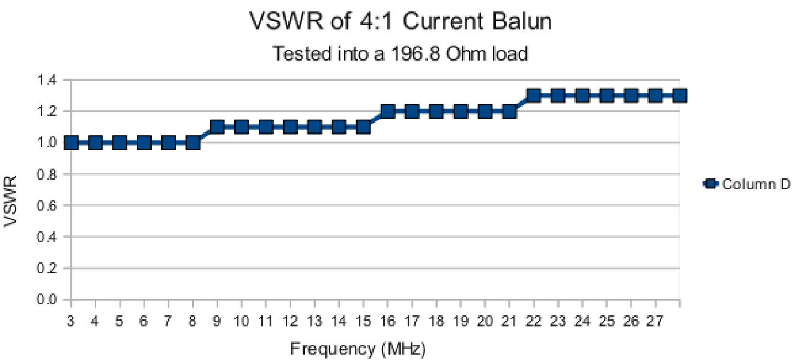
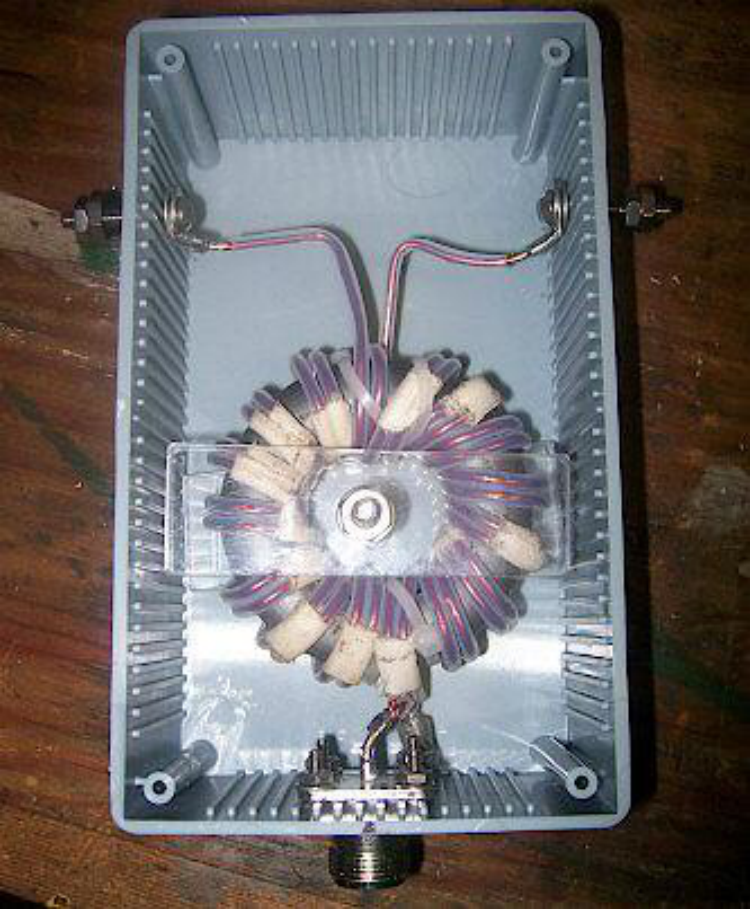

**如何制作4:1电流巴伦**

**作者：Bryce Salmi - KB1LQC**

本文介绍了一个制作4:1（四比一）电流巴伦的项目，也称为"Guanella"巴伦。我制作的这个巴伦是在2009年夏天完成的，之后一直整齐地保存在我的工程笔记本中。天线是无线电的一个迷人方面，而巴伦是大多数业余无线电爱好者电台不可或缺的组成部分。术语
[[巴伦]{.underline}](https://secure.wikimedia.org/wikipedia/en/wiki/Balun)
"...是*平*衡到*非*平衡这两个词的缩写。它的主要功能是防止共模电流，同时从不平衡传输线转换到平衡负载，如天线"1 我最喜欢的线天线之一是偏馈偶极天线（OCFD）（实际上是一个双极天线，这是另一个文章的好话题），因为它性能稳定且具有有用的工作特性。我的巴伦将成为OCFD的一部分，我计划让一些K2GXT成员在冬天帮助建造，沿着我们的地下隧道系统作为一个整洁、快速、有趣的单次会议副项目。

这个项目可以用于各种应用，不仅限于OCFD，另一个流行的用途是将同轴电缆转换为平衡馈线（200欧姆）。任何需要匹配50欧姆到200欧姆阻抗的应用都会从这个项目中受益。如果您从未制作过巴伦，那么这可能是您开始制作的邀请。我大约五年前在马萨诸塞州与[[Billerica业余]{.underline}](http://www.w1hh.org/) [[无线电协会]{.underline}](http://www.w1hh.org/)的当地俱乐部会议期间首次制作了其中一个。所有变压器部件都包含在套件中，但您有自由制作任何感兴趣的巴伦样式。
{width="3.1222222222222222in"
height="3.7744192913385826in"}

我想强调的一件事是，在这个项目中，所有金属硬件如螺母、垫圈和螺栓都是不锈钢的。任何用于天线的金属硬件

{width="3.4902777777777776in"
height="1.3729965004374454in"}

在可能的情况下应该是不锈钢的，因为它不会腐蚀，这有助于保持多年的良好电气和机械连接。但是，您不能焊接不锈钢，这需要其他连接金属的方法，如螺母和螺栓。

**设计和制作巴伦**

开始制作4:1电流巴伦最简单的方法是订购

> [[AB240-250](https://www.amidoncorp.com/items/60) [K Mix巴伦
> 套件](https://www.amidoncorp.com/items/60)]{.underline} 来自

Amidon Associates。这个套件包括合适的环形磁芯、12.5英尺的#14磁线、12.5英尺的特氟龙管，以及Jerry Sevick, W2FMI的[[传输线]{.underline}](https://www.amidoncorp.com/items/46)\
[[变压器手册]{.underline}](https://www.amidoncorp.com/items/46)2。制作巴伦所需的一切都包含在内，包括绕线说明。我选择为我的偏馈偶极天线制作的电流巴伦是[传输线变压器手册]{.underline}第31页上的HBM200。有了这个套件，您不仅可以学到更多关于传输线变压器的知识，而且很难击败这个价格（我买的时候是25美元），而大多数商业电流巴伦的成本可能是这个价格的几倍。

{width="3.959722222222222in"
height="1.3692497812773403in"}

HBM200可以无限期地处理2KW（2000瓦）的连续功率，并在正确匹配时支持4KW的峰值功率水平。环形磁芯的最大敌人是过热，这会使它们破裂，使巴伦失效。这个设计由W2FMI设计，效率为98%，这意味着在操作期间巴伦内部产生的热量很少。为了正确匹配50欧姆同轴电缆到馈点阻抗，巴伦执行4:1变换，50欧姆 × 4 = 200欧姆，接收时相反，将200欧姆转换为50欧姆。

**绕制环形磁芯**

制作巴伦最令人畏惧的部分是绕制变压器。说实话，如果电子电路中有我必须绕制的环形电感器，我过去会避免制作它，它们让我害怕。

> 如果我不是唯一一个被吓到的人，我也不会感到惊讶，不过，我时不时会感到惊讶！有一个巧妙的方法可以让绕制环形磁芯变得容易得多。要计算磁芯上的匝数，您*只计算通过中心的匝数*，它看起来像一个甜甜圈，所以实际上一点也不难。用一小块胶带或颜色标记标记每根线的末端以供将来参考也是一个好主意。我将导线分成两个线对，总共八个末端后，在每个线端贴上带有适当数字（如示意图所示）的小块遮蔽胶带。读者将在文章后面看到这种方法如何派上用场。

制作传输线变压器的第一步是准备绕线。取磁线并将特氟龙管套在整个长度上，线和管的长度应该接近，但可能不完全相同。完成后，将线对折，在折痕处切割，这显然是线的中心。将两根线均匀地配对并用电工胶带或医用胶带固定，这也很好用，特氟龙管是

电介质，而不是胶带，胶带只是将线固定在一起。沿着整个线长每隔几英寸贴胶带。现在应该有大约六英尺的配对特氟龙覆盖线对准备在环形磁芯上绕制。4:1电流巴伦使用两个双线绕组，每个包含八匝。双线绕组简单意味着两根线相互跟随。类似地，我们会在三线绕组中使用三根线，简单吧？开始时留大约一英寸的线悬在末端以便稍后连接。尽可能紧密地通过环形磁芯绕一匝，无论您顺时针还是逆时针绕制都没有关系。绕制后用线扎固定线。对于我的电流巴伦设计，我继续在环形磁芯中心总共绕制八匝。尝试紧密绕制但不要重叠。将所有线安装在环形磁芯上充其量是紧密的挤压。在末端留几英寸以便稍后连接，并切断几英尺的线对用于环形磁芯的另一侧。环形磁芯的一半现在应该有线，另一半应该仍然是裸露的。

第一个绕组完成后，最困难的部分几乎结束了。取剩余的配对线，在环形磁芯的另一半上使用相同的方法，但这次朝相反方向绕制。例如，如果您首先顺时针绕制，现在从同一端开始逆时针绕制。应该有足够的线来紧密地制作两个绕组，并留一点余量用于连接。不要担心绕组末端附近的一点重叠，参考图片了解正确绕制巴伦的示例。当您清楚所有手工工作都正确时，用线扎固定第二个绕组的末端。
{width="3.1222222222222222in"
height="2.0814818460192477in"}

现在我们需要将线焊接在一起以获得功能正常的传输线变压器。按照上面显示的示意图，这应该是有意义的，因为我们在绕制之前已经标记了线（我希望您这样做了！），取线端1并将其连接到线端5，它应该就在旁边。还要用短线将端4和6连接在一起。端3和7连接在一起形成50欧姆侧的中心

{width="3.1222222222222222in"
height="2.086106736657918in"}

导体线对。端2和8应该是自由的，用于连接到天线，它们现在应该留长。小心不要在环形磁芯上短路，如果通电的话结果不会好，只需保持一些特氟龙管足够长以保护每根线的末端。我对暴露的焊接连接进行了热缩处理，如您所见，并使用了适当尺寸的眼孔安装硬件连接到不锈钢螺丝。

**将所有部件连接在一起**

现在是时候放下巴伦并专注于安装位置了。由于我的设计将在户外使用，我需要考虑巴伦的防水。我决定使用天线绝缘子将巴伦悬挂在下方，而不是使用巴伦外壳作为结构支撑。

> 这很方便，因为我不必担心天线线在安装时施加的张力，同时寻找外壳。我选择使用在马萨诸塞州利特尔顿当地电子商店"[[Electronics Plus]{.underline}](http://www.electronicsplus.com/)"购买的Philmore品牌塑料外壳

{width="3.1222222222222222in"
height="2.0814818460192477in"}

（它们仍然存在！）。或者，可以使用PVC管，就像市场上可以购买的一些巴伦一样。但是，我通过经验发现PVC往往很重，会导致天线大量下垂，这是非常不理想的。

下面的图片显示了我如何决定将巴伦安装在机箱内。保持巴伦同轴电缆侧的线尽可能短是非常重要的。我连接到N型机箱安装连接器的连接大约2厘米长。接地连接通过#8焊接片（眼孔）和4-40螺丝连接到固定连接器的螺丝上，而我焊接了一小段#14线到中心导体，因为它意外地太短了，从我的错误中学习，如果可能的话尽量避免这种情况。我使用N型连接器，因为它们实际上是50欧姆的，并且相当耐候，不像SO-239 UHF连接器，由于焊接的中心导体，众所周知不是50欧姆，需要相当大的防水帮助。然而，这最终是个人偏好。

将巴伦的200欧姆端连接到天线在长度上不那么关键；线现在成为天线的一部分。我大约有6厘米的线剩余，所以我向上3厘米，向外3厘米，用连接到外部螺栓的#8焊接片进行连接。这在某种程度上模仿了天线中线应该的位置，尽管我确信这在HF波长下更多是美观而不是实用的。用于天线连接的8-32螺丝从内向外安装，这样它们可以用螺母锁定到位，并且更容易操作。每侧每个螺栓使用三个螺母。

巴伦通过被挤压在两块有机玻璃之间和一个两英寸的#10螺栓来安全安装，用于定位巴伦，使连接器不会承受太多张力。将巴伦挤压到位可以防止机械振动，这些振动可能会随着时间的推移使焊接连接破裂。我喜欢尽可能使项目具有故障安全功能；必须考虑良好的电气和机械连接。此外，金属螺栓不会影响巴伦的性能，因为理想的巴伦将磁场包含在环形磁芯内。

**测试巴伦**

{width="4.1625in" height="5.161500437445319in"}

测试电流巴伦的最佳方法是使用天线分析仪，如MFJ-269天线分析仪。虽然人们可以希望最好并直接将巴伦投入使用，但我喜欢在安装前进行测试。

> 测试4:1 Guanella

电流巴伦很容易做到。由于我们要匹配50欧姆到200欧姆，真正需要做的就是在天线端子之间连接200欧姆。MFJ天线分析仪不会输出太多功率，所以两个1/4瓦100欧姆电阻串联工作得很好。为了获得最佳结果，保持连接尽可能短，参考图片更好地了解我的设置。

巴伦的测试电阻负载用万用表测量为196.8欧姆，对我来说足够接近。负载的总长度在端子之间大约七英寸。对于RF，必须保持连接长度尽可能短。表格和图表显示了用MFJ天线分析仪连接到50欧姆连接器时测量的VSWR值，如许多照片中所示。巴伦的宽带性能表明它工作得非常好，我对它在整个HF频谱上1.3:1的性能感到满意。VSWR性能优于1.5:1可能比天线系统的其他部分（如SO-239和PL-259连接器）更好，所以我不担心巴伦处的1.3:1 SWR。为了进一步测试巴伦，将同轴电缆侧的接地线连接到天线端子的两侧和两个100欧姆电阻之间，在每个位置独立测量。如果巴伦保持相对稳定，您就处于良好状态，我的在做这个时跳到2:1 SWR，这是可以的；SWR跳跃大于10:1应该引起关注。然而，这是一个粗略的测试，所以请从容应对。

**最终组装** {width="6.122222222222222in"
height="2.7744214785651793in"}

这个巴伦的机械设计本身不能支撑大量重量或张力。我计划通过将外壳连接到PVC、有机玻璃或玻璃纤维来安装外壳，这些材料反过来承受天线的张力。

{width="3.4694444444444446in"
height="4.20496719160105in"}

> 还应该仔细考虑支撑悬挂在巴伦下方的同轴电缆的重量。支撑同轴电缆以减轻Philmore外壳的负载可能最终是关键的。另一个考虑因素是巴伦本身的最终重量。更重的巴伦会导致更多的天线下垂。

巴伦制作的最后一步是密封它。如果大量使用，RV密封剂效果很好。通过稍微拧出天线螺丝并在螺纹中工作一些密封剂，然后拧紧它们，将密封剂应用到天线螺丝上。以同样的方式密封眼钩和巴伦有机玻璃螺栓。我发现的对N型连接器进行防水的最佳方法是在边缘和螺母上大量涂抹密封剂

和螺栓，在任何水可能进入的地方。在密封盖子之前让内部干燥可能是最好的。我的项目盒的盖子最后用密封剂珠密封，沿着整个盒盖边缘，然后是盖子本身和螺丝，紧紧固定盖子。有些人可能更喜欢在这个时候钻一个小孔，总是朝下，让内部冷凝水排出，但雨水不会进入。

**结论**

这个Guanella电流巴伦是实用的，相对容易制作，对所有希望制作值得信赖的HF天线（如偏馈偶极天线）的业余无线电爱好者来说都非常有用。天线性能被许多人（包括我自己）认为有时比无线电的性能更重要。糟糕的天线系统会导致任何无线电表现不佳。这个巴伦将轻松处理美国法定限制，并在制作过程中提供一些教育乐趣。我鼓励任何发现这篇文章有帮助、有启发性或有任何问题或更正的人让我知道！电子邮件...我的呼号在arrl.net。KB1LQC

1: 美国业余无线电中继联盟。"将线路耦合到天线。"*天线手册*。编辑：R. Dean Straw。第20版。2005年。26.1-26.28。印刷版。

2: 传输线变压器手册。Jerry Sevick。（您可能能够在二手市场找到这本书或在Google上搜索下载...编辑！）
