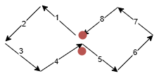
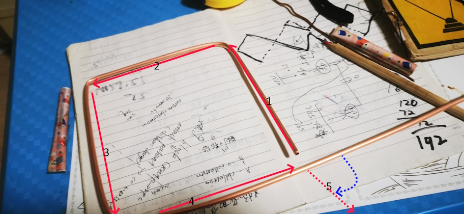
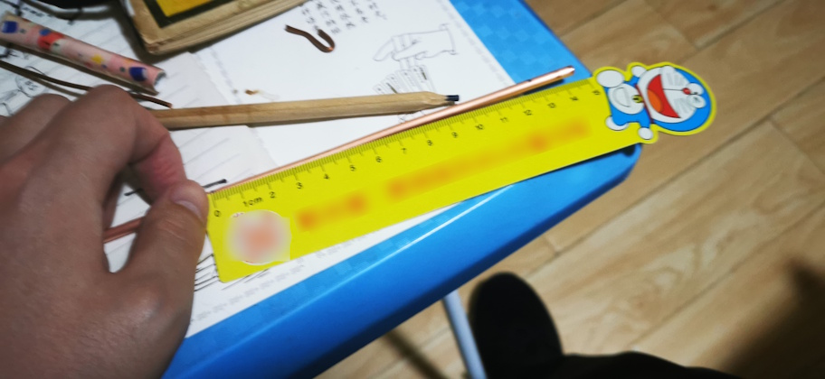

# 二单元菱形天线制作
之前制作一个四单元菱形天线，这次制作一个二单元菱形天线。二单元菱形天线用材少，制作起来比四单元要简单一些。这次天线的材料取材自某多多的 4mm 紫铜管（壁厚 0.5mm），经过实验，这种直径的铜管用手即可弯折，且弯折后不易变形。下面给出弯折的步骤：

这次选择菱形的边长为 12.5cm，这样两单元菱形的总长度一共是 1m，比较好选购材料。

> 在电磁波中，**波长（λ）和频率（f）**之间的关系由以下公式描述：
> 波长 × 频率 = 光速
> 用公式表示为：λ × f = c
其中：
> λ 是波长（单位：米）
> f 是频率（单位：赫兹，Hz）
> c 是光速，约为 3 × 10^8 米/秒（在真空中）
> 
> 我们选择 12.5cm 边长，对应的是 λ / 4, 则 λ = 12.5cm × 4 = 50cm = 0.5m , 则频率 f = c / λ = 3 × 10^8 m/s / 0.5m = 600MHz。
> 
> 所以这个长度的天线适合 500 - 700MHz 的频段。

这里给出弯折的步骤，给初学者一个参考，防止大家弯错方向，走弯路。

图 1.1

图 1.2

推荐使用直尺来测量长度，卷尺不容易平铺在桌面上，不好测量。

图 1.3

