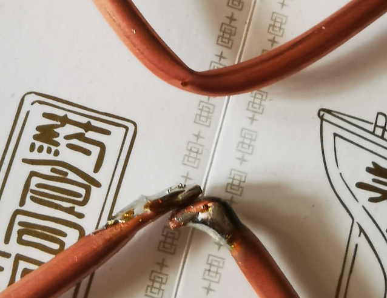
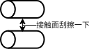
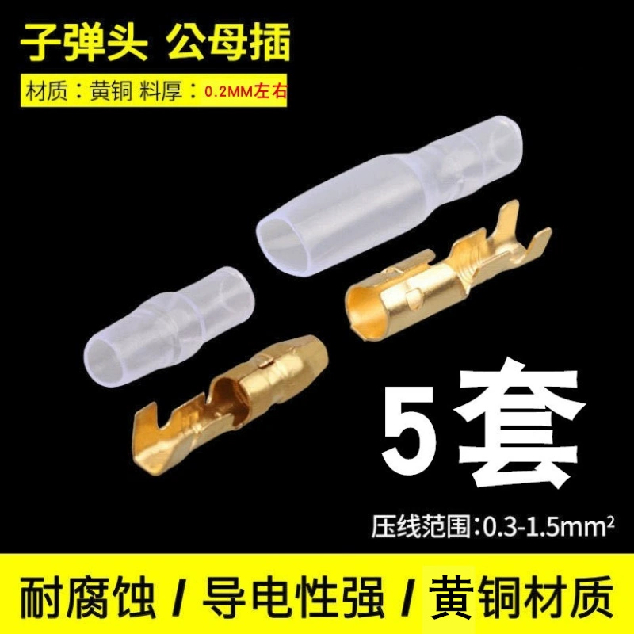
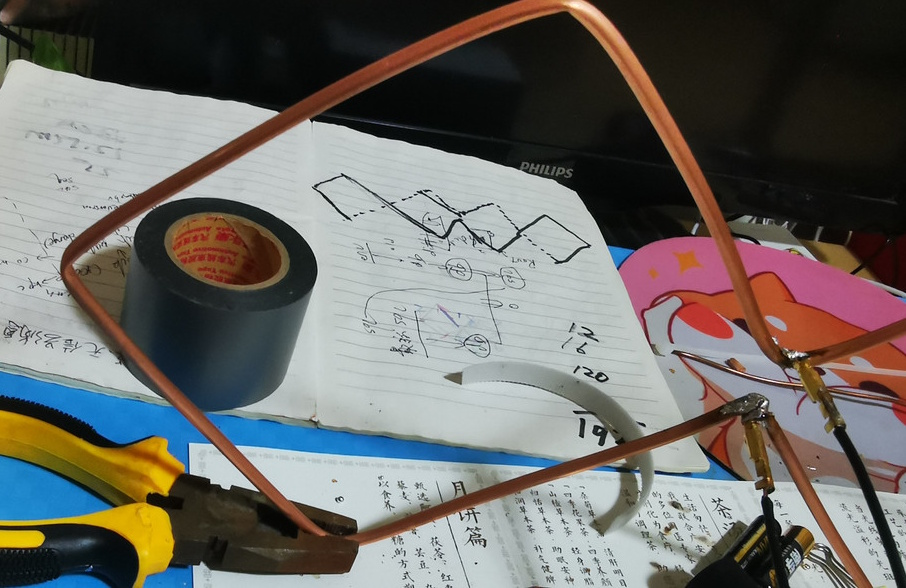

# 二单元菱形天线制作
之前制作一个四单元菱形天线，这次制作一个二单元菱形天线。二单元菱形天线用材少，制作起来比四单元要简单一些。
## 1. 弯折
这次天线的材料取材自某多多的 4mm 紫铜管（壁厚 0.5mm），经过实验，这种直径的铜管用手即可弯折，且弯折后不易变形。下面给出弯折的步骤：

这次选择菱形的边长为 12.5cm，这样两单元菱形的总长度一共是 1m，比较好选购材料。

> 在电磁波中，**波长（λ）和频率（f）**之间的关系由以下公式描述：
> 波长 × 频率 = 光速
> 用公式表示为：λ × f = c
其中：
> λ 是波长（单位：米）
> f 是频率（单位：赫兹，Hz）
> c 是光速，约为 3 × 10^8 米/秒（在真空中）
> 
> 我们选择 12.5cm 边长，对应的是 λ / 4, 则 λ = 12.5cm × 4 = 50cm = 0.5m , 则频率 f = c / λ = 3 × 10^8 m/s / 0.5m = 600MHz。
> 
> 所以这个长度的天线适合 500 - 700MHz 的频段。

这里给出弯折的步骤，给初学者一个参考，防止大家弯错方向，走弯路。

图 1.1

图 1.2

推荐使用直尺来测量长度，卷尺不容易平铺在桌面上，不好测量。每次量出 λ / 4 长度时用记号笔或者深色铅笔打上标记，推荐使用后者（2B或者木工铅笔），因为记号笔容易被擦掉。

图 1.3

为了方便接下来的焊接流程，我们在图1.1中最后一个边，故意留长约1cm，将这 1cm 弯折并且用老虎钳子捏扁：

图 1.4

## 2. 焊接
折叠完成后，就需要将其焊接起来，你需要一个电烙铁，网上卖的那种 60W 的就可以。焊接时注意戴好劳保手套，防止被烫伤。虽然我们用的金属材质是铜，和焊接用的锡是比较好结合的，但是我们依然需要在焊接之前将接触面用壁纸刀刮擦一下，好去除表面的已经被氧化的浮层。

图 2.1

刮擦完之后，记得将接触面再浸润一下松香，这样可以更好的上锡。接着就是将接触面全都分别上锡。使用电烙铁将融化的焊锡接触到铜管上时，一开始会是一个水滴状，这是由于锡在接触到铜管时热量被铜管给吸收走了，融化的锡温度下降了，用烙铁头在铜管上来回摩擦上几下，铜管就会被加热，焊锡就能更好的平铺在铜的表面，这时候放开烙铁头，等待锡固化即可。

由于我们接触面是提前上锡的，上完锡之后，也不会自动粘结在一起，因为他们的锡已经固化。这时候我们需要二次加热，让已经固化的锡重新溶解，然后粘在一起。这个过程中肯定需要让两个接触面尽量靠在一起，所以我们选择在接触面的背面来上锡，借助融化的锡液将热量传导到接触的两面。

图 2.2

焊接完天线骨架，还需要焊接接线柱，方便我们后续的接线工作。这里我们选择了某宝的购买的可拆卸接线柱：

图 2.3

这个接线柱的大小恰好合适焊接在图 2.2 的背面。焊接到铜管之前，将和铜管接触的凹槽直接展开，用壁纸刀刮一下表面，浸润一下松香，然后上锡。

图 2.4

由于这个接线端子比较小，烙铁不好操作，可以将整个天线用老虎钳子夹起来，放置在桌面上，就像这样：

图 2.5

这时候可以一只手用镊子夹住接线柱，一只手用电烙铁给接线柱和铜管接触面的背面来上锡，同样原理就可以再次实现融化接触面凝固锡层的目的。