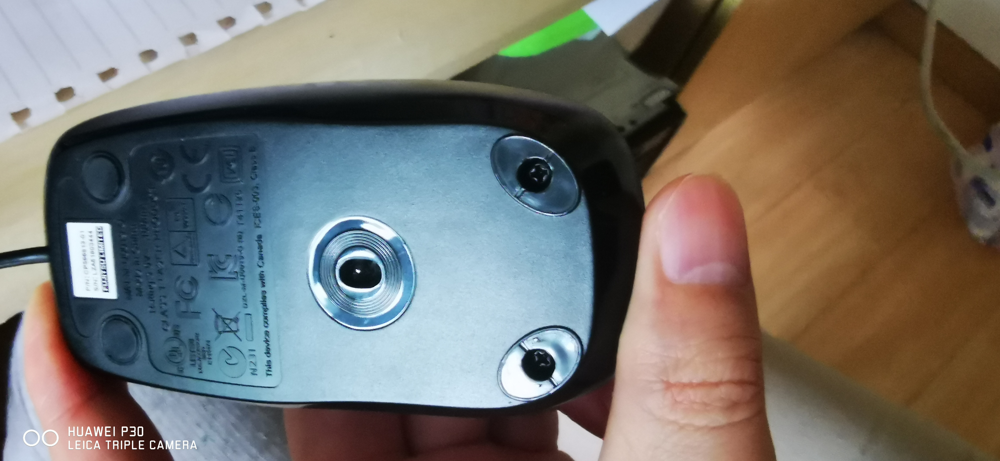
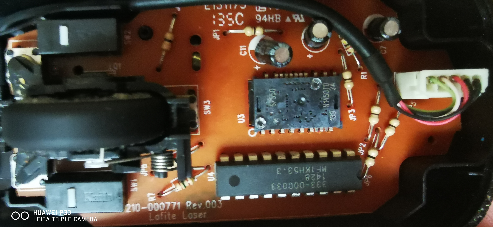
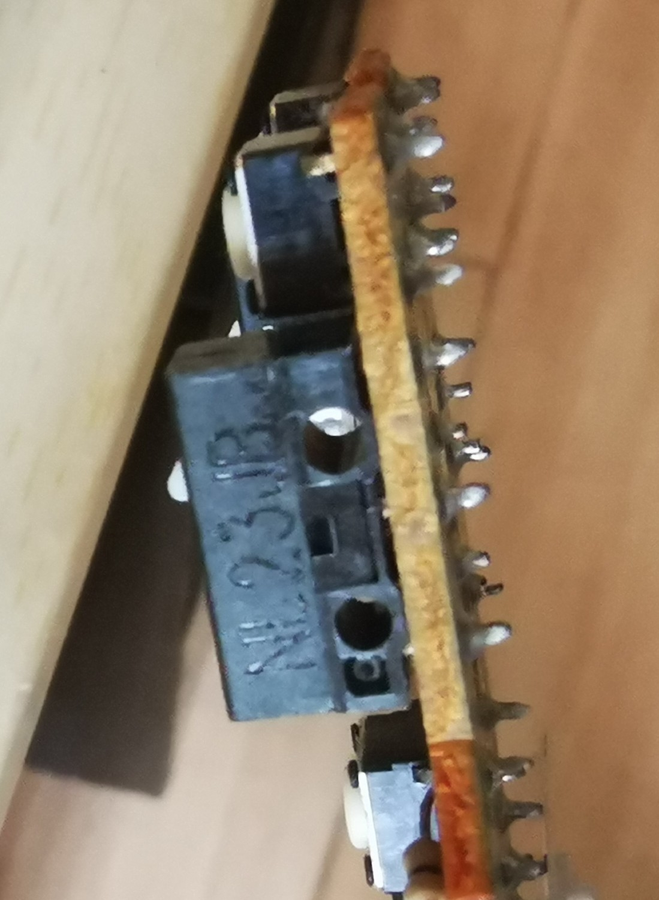
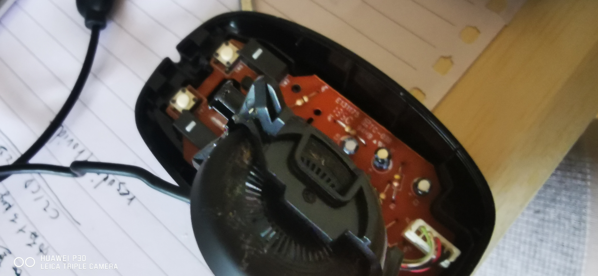
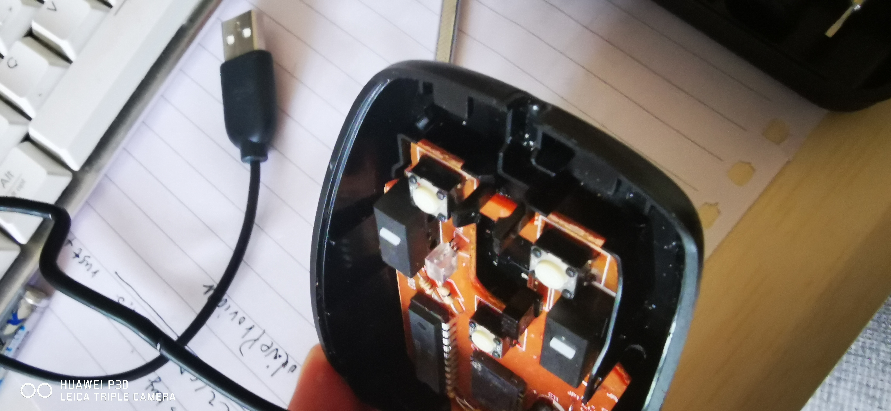
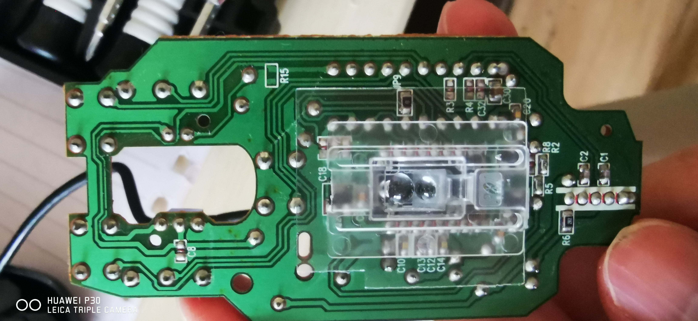
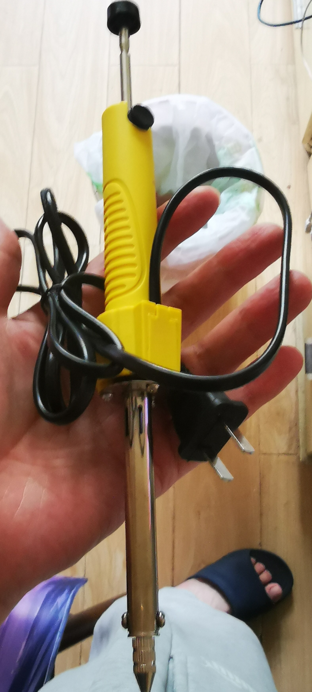
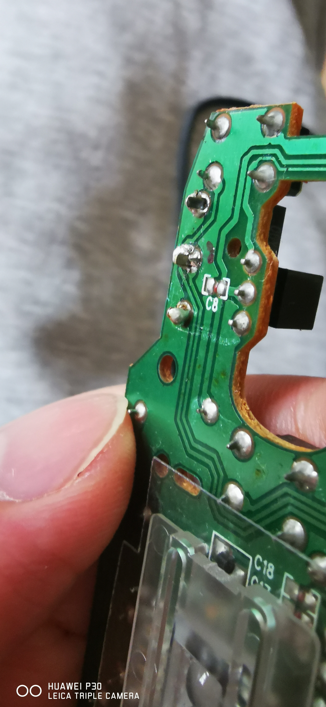

# 富士通 CP566813-01 拆解换微动

这款富士通小鼠标约两年前花 20 块钱购于某宝，这些天逐渐发现其右键有双击的现象发生，应该是微动有问题，想着周末趁自己有空，将其更换一下。

这款鼠标的螺丝隐藏在下部贴脚的下方，螺丝孔还是有些深的，使用磁铁是探测不到的。

拆开后可以看到里面的用料还是挺足的，有很多电阻和电容。

不过就是这个凯华的微动配置寒碜了点，我看了一下型号，NL23JB 在网上也没有找到相关资料。但是通过搜索白点的凯华资料看，不会超过一千万次。

主板上面的滚轮是卡在主板上的，所以需要先把其拆下来，然后才能拆下主板。

然后就可以看到背面

这时候就临到吸锡器出场了

手动一个欧姆龙的 2000 万次微动，用电烙铁使用自己简陋的焊接技术，将其焊接上

重新组装上，再用一段时间看看是否修好了。
