# 棒状天线

前些日在和 AI 聊天的时候，无意得知棒状天线虽然增益低，但是方向性弱，在室内接受的过程中，有可能会大力出奇迹，不用特别纠结摆放位置，效果反而比其他高增益天线要好。看到这个结论一时心痒难以，于是决定自己动手做一个棒状天线，看看效果如何。

## 1. 初次制作

AI 告诉我棒状天线只需要一个金属棒加一个地网就可以了，金属棒可以理解，地网可以使用几根金属丝交叉编织成网状，或者使用金属板。编织金属丝网对我来说就有点挑战性了，因为不是很好和金属棒焊接在一起，所以我选择了使用金属板作为地网。因为我想到金属板，我可以找一个盘子来代替啊，说干就干，我搜了一下淘宝，因为我有 88 VIP 的缘故，所以就挑免邮的，最后在淘宝上买了一个 20cm 的不锈钢浅盘，价格 2.9 元，刨去 2 元红包，实付 0.9 元。同时根据 AI 的指示，金属棒直径 1cm 时效果最好，所以我在淘宝上买了一根 1cm 的铜管，价格 7.5 元，刨去 2 元红包，实付 5.5 元。其实铜管直径只要大于 0.5cm 即可，我这里买 1cm 的主要是为了达到理论最优值。

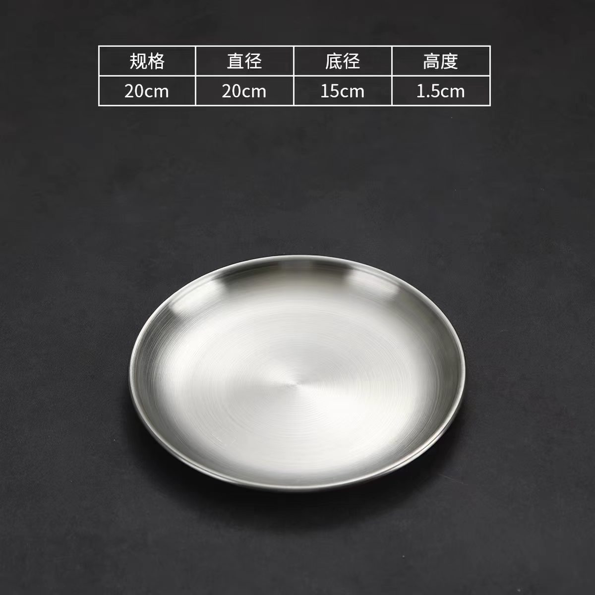

**图 1.1 20cm 不锈钢浅盘**

不锈钢盘到货后，我首先给其打孔，现在圆心四周打上四个孔，这些孔跟天线制作无关，我想着后面如果想固定的话，这四个孔可以穿绳帮在杆子上。圆心 1cm 处的孔才是跟天线制作相关的孔，因为不锈钢是没法使用电烙铁焊接的，所以就留一个孔，后面可以用螺丝固定同轴线的外屏蔽层。

铜管到货后，我截取了 12cm 的长度。

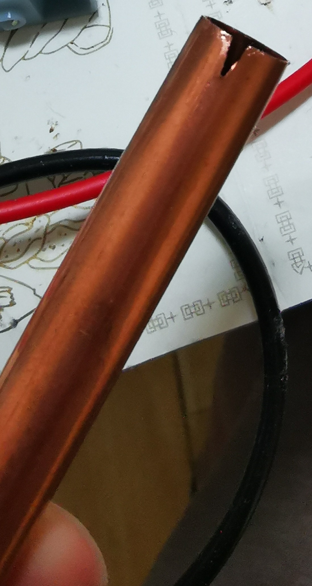

**图 1.2 裁切后的铜管**

> 我选取了 600MHz 作为测试频率，棒状天线的长度为波长的四分之一，波长 λ = c / f，其中 c 为光速，f 为频率。600 MHz 的波长约为 0.5 米，所以四分之一波长约为 12.5 cm。因为电磁波在天线金属附近传播时，不是完全按真空中的速度和边界条件走，所以天线通常要做得比理论值短一点，才能在目标频率上共振，公式上可以这样理解：实际长度 = 理论长度 × 缩短系数，缩短系数的常见范围大约 0.9 到 0.98，我这里取了 0.96，所以截取长度为 12.5 × 0.96 ≈ 12 cm。

一开始，我在圆盘中心放置了一颗纽扣，我想将纽扣粘在圆盘上，然后再将铜管粘在纽扣上，这样就可以将铜管固定在圆盘中心了。可是我发现，铜管和纽扣的接触面积太小了，固定不牢靠，换了几次胶水都失败了。

后来我想到一个办法，我可以在圆盘中心打一个孔，然后将铜管插入孔中，再用螺丝固定，这样就可以将铜管固定在圆盘中心了。当然铜管和圆盘之间是需要绝缘的，为此我专门从淘宝上调研了一番，最终敲定了一个方案，铜管和圆盘之间使用一个塑料垫片来绝缘，使用一个塑料螺丝从圆盘底部穿过塑料垫片和铜管，最后向铜管内部注入胶水进行固定。

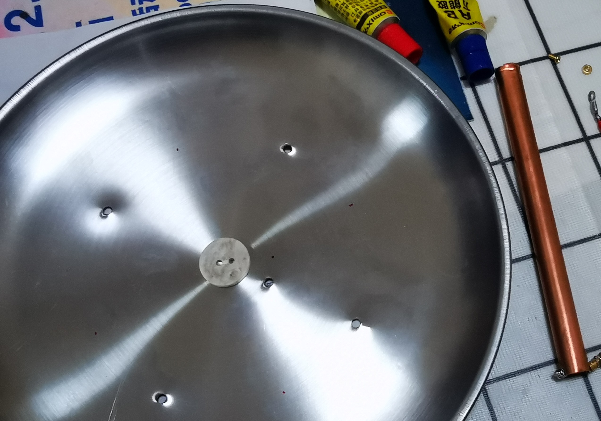

**图 1.3 打孔后的盘子和铜管布局**

塑料垫片采用的是这种规格

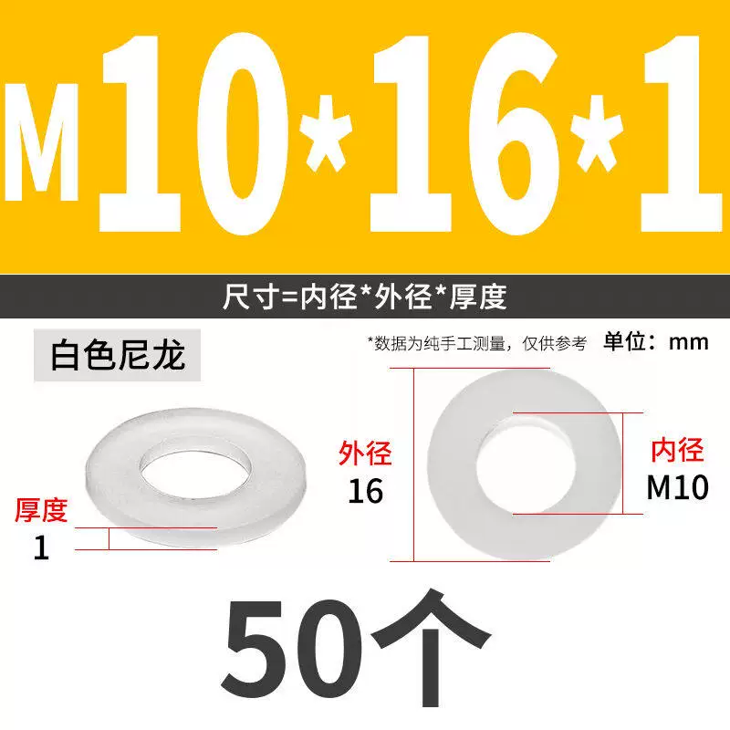

**图 1.4 M10 尼龙垫片规格**

> 价格 2.15 元，使用红包后，实付 0.15 元。

塑料螺丝采用的是这种规格，

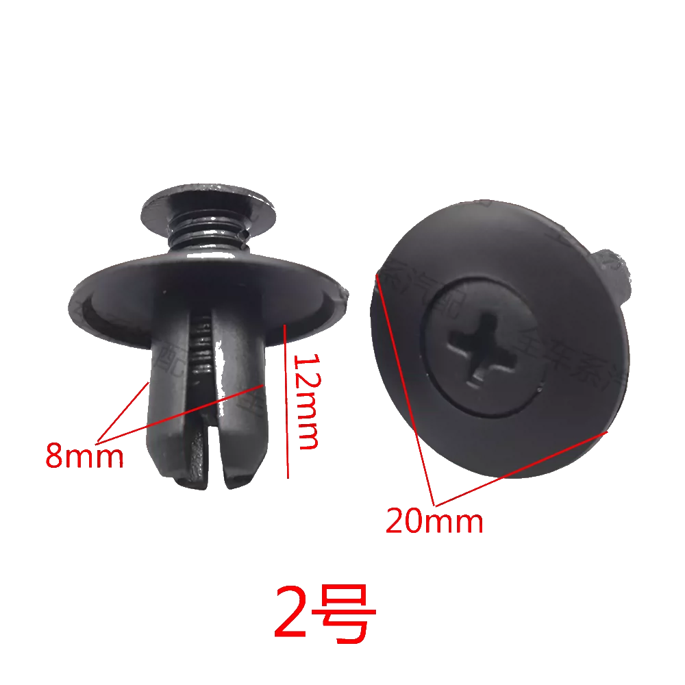

**图 1.5 塑料螺丝规格**

> 价格 2.28 元，使用红包后，实付 0.28 元。

灌注胶水的时候，可以先将铜管头部用胶带封死，然后从圆盘底部将胶水注入铜管内部，然后讲圆盘底部用胶带封死，讲圆盘翻过来，等待胶水固化即可。胶水用的是油性原胶。家里自备的，没有购买。

一开始我在馈线和天线处使用了自制空芯巴伦进行连接，制作完后发现，发现效果并不好，然后我就断定制作失败了，经过 AI 指导的天线制作方法，也未必可靠。
> 之前写的空芯巴伦的文章：[自制 DTMB 巴伦](https://ant.whyun.com/balun_custom) 。

## 2. 再次制作

制作好的天线被我放到窗户边上放了好久，最近无意中又冒出来一个念头，既然这些天 AI 又进化了许多，是不是可以重新问一下它巴伦制作的最佳方法呢？没有想到这次它给推荐的方案是使用磁环巴伦。尽然没推荐空芯巴伦，不死心的我又问了一下空芯巴伦适合制作 dtmb 巴伦吗。结果它告诉我

> 频段太高，线圈的寄生电容、引线长度、圈间耦合都会很明显，实际可能变成一个不稳定的谐振器。结果可能是某些频道变好，另一些频道变差，甚至移动一下线缆信号就变。

磁环巴伦面临的最大问题是 UHF 频段的磁环材料不容易买到。我在淘宝上搜了一下高频磁环，竟然发现了国产的磁环，其为卡扣样式，正好可以扣在同轴线的外层上。选择它还有一个重要理由，其特性阻抗可支持 UHF 频段，我买了孔径为 8mm 的，通过图中可以看出厂家的给的特性阻抗图在 8mm 的时候，只给到了 500MHz，500MHz 以上的特性阻抗没有给出，不过其他孔径的都给到了 1000 Mhz，本着试试看的态度先买回来。

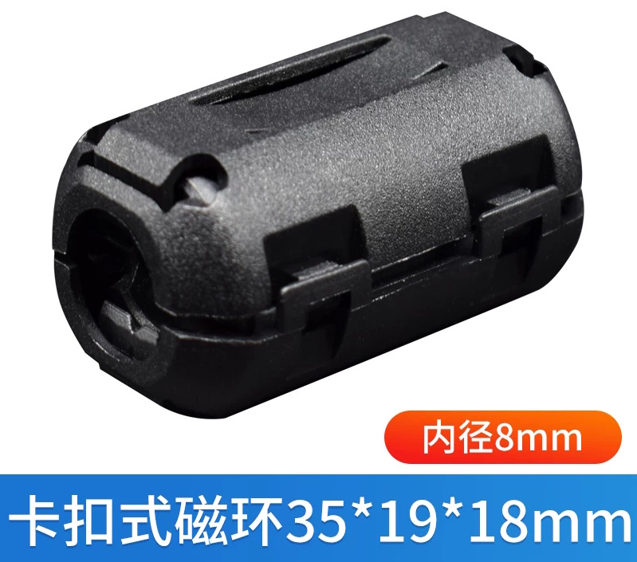

**图 2.1 卡扣磁环**

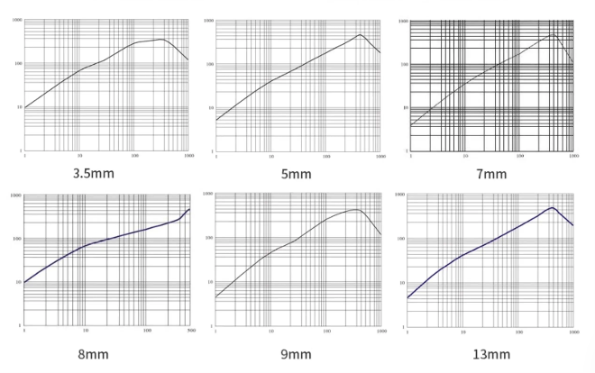

**图 2.2 特性阻抗**

> 商家只提供了 5 个打包购买的选项，价格为 16.2 元。

> 下面不再提红包的事情，写起来太麻烦。

在加载磁环之前，我先把铜管上原来的焊点清除掉，购买了一段 1m 长的 75 欧同轴电缆，价格 2.08 元。截取大概 15 cm，剥开同轴电缆的外层屏蔽层，将同轴电缆的内导体焊接在铜管的中心孔上。同轴电缆的外层屏蔽层焊拧在一起，焊接上镀银铜垫片，其规格如下：

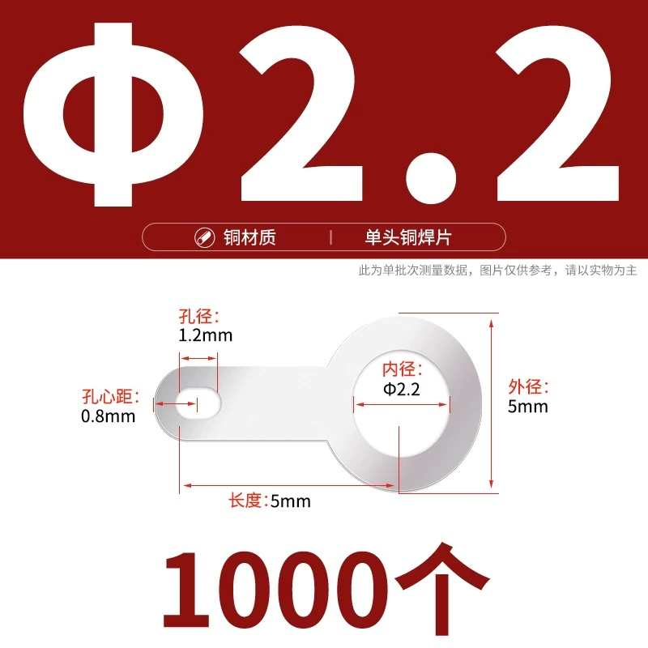

**图 2.3 镀银铜垫片**

> 垫片价格 2.11 元。

然后使用十字圆头黄头螺丝将其固定在圆盘上，螺丝规格如下：

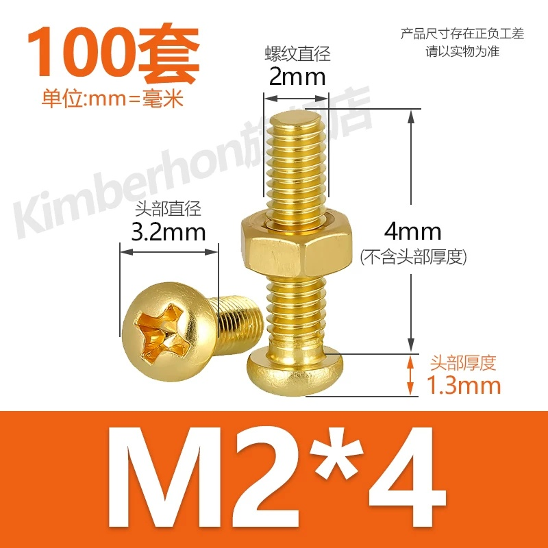

**图 2.4 十字螺丝**

> 螺丝价格 4.43 元。

同轴电缆的另外一头固定上 F 母头，F 母头的规格如下：

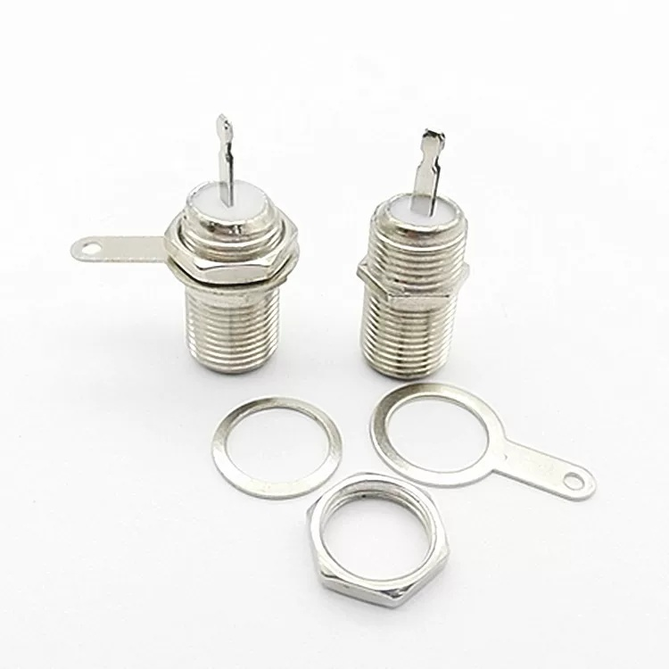

**图 2.5 F母头**

> F 母头价格 2.24 元。

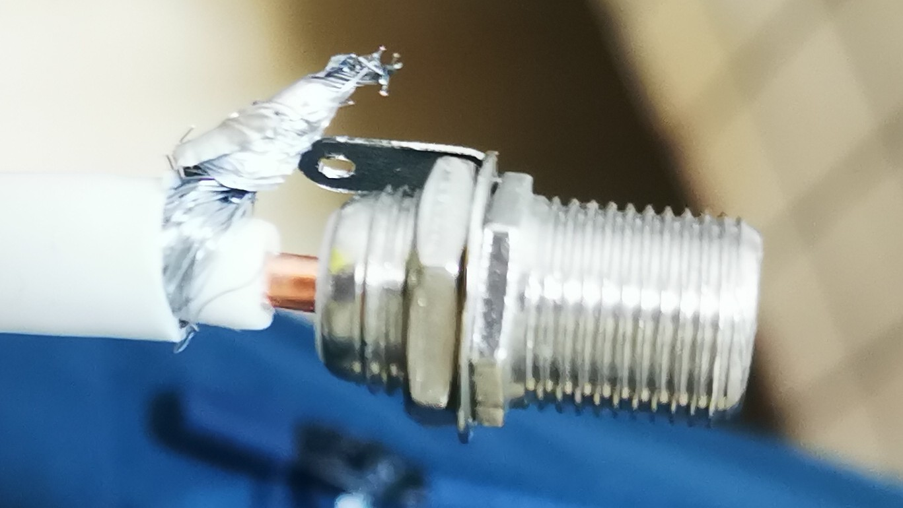

**图 2.6 F 头连接制作步骤1**

之前恰好买过一批铜柱，用来做导线的连接，看上去比同轴的芯线和 F 头芯线连接部位稍微粗一些，就直接拿来用了，省去了这部分的焊接过程。

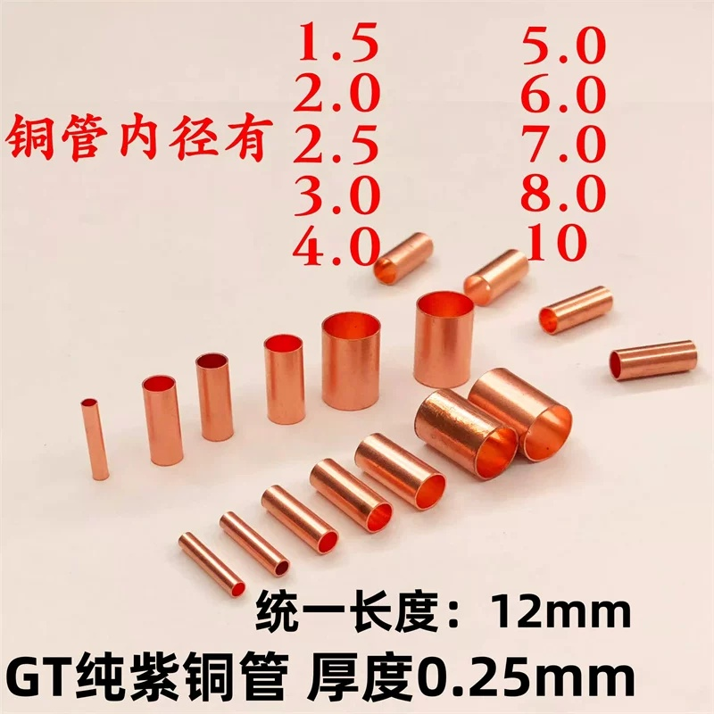

**图 2.7 2mm铜柱**

> 铜柱的价格 2.27 元。

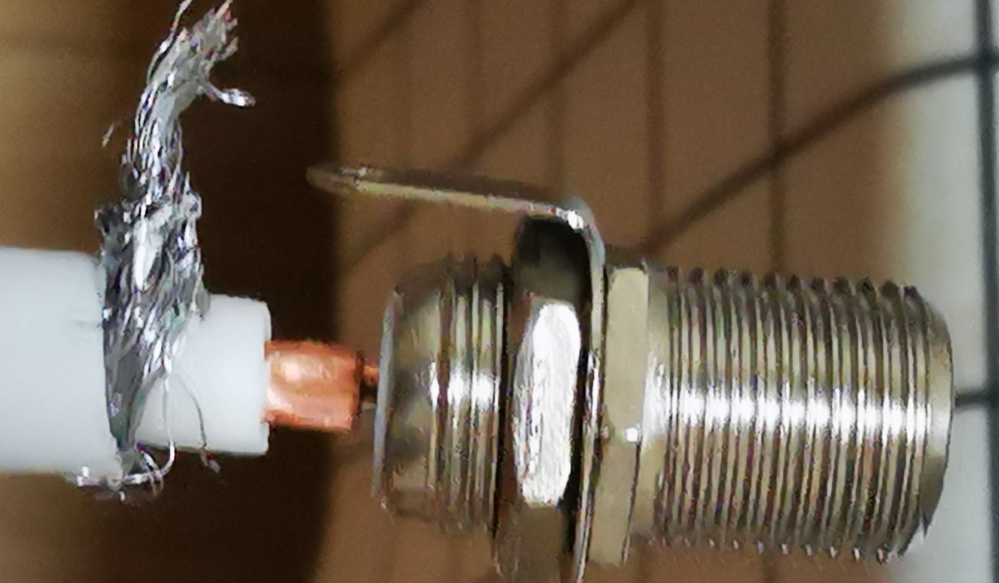

**图 2.8 F 头连接制作步骤2**

将铜柱一端插入到同轴芯线所在的绝缘 PVC 塑料中，一端插入到 F 头的芯线连接部位，同轴和 F 头芯线连接部分可以重叠在一起，然后用钳子压紧铜柱。不过屏蔽层部位还是需要做焊接的。

所有部分焊接完成后，将磁环扣在同轴电缆的外层屏蔽层上，磁环的位置尽量靠近铜管。接下来就可以测试了，一开始我将圆盘平放，发现信号质量不佳，本来用双菱能稳定收到的信号（562Mhz）都出现马赛克，想着这次制作可能又失败了。不过我还是不死心，将盘子直接竖着放在了这个位置，没有想到出奇迹了，不但 562Mhz 能正常接收了，666Mhz 也能正常接收了，而 666Mhz 之前用双菱接收是很困难的，这次直接过门限了，信号质量在 18db 左右。甚至连 674Mhz 都能收看了，其信号质量在 20db，但是偶尔不稳定会突然将为 0 ，出现马赛克，但是 666Mhz虽然质量不高，但是稳如老狗。

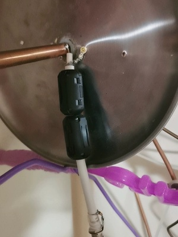

**图 2.9 最终测试位置**

> 使用一个磁环即可，两个磁环和一个磁环效果是一样的。
>
> 还有一个问题需要留意，盘子的摆放位置也很重要，之前使用空芯巴伦时，没有向**图 2.9** 那样摆放，所以目前无法再做对比测试，因为之前的巴伦已经拆掉了。所以是不是空芯巴伦真的不好用，现在也不好说。

不过上述制作的一个关键是磁环，将磁环拿掉后，666Mhz 和 674Mhz 都不能稳定接收了。当然一开始，我对于商家给出的阻抗频率图是有怀疑的，我专门找客服要了他们的参数文档，发现他们最高只测试了 100Mhz 下的阻抗：

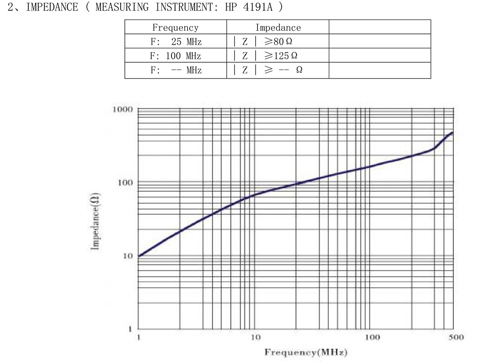

**图 2.10 实际测量阻抗**

不知道他们曲线中高频部分是怎么绘制出来的，也就是说这个曲线有可能是不真实的，在高频部分有可能阻抗根本就不达标。所以当前这个磁环到底是起到了巴伦的作用，做平衡不平衡转化；还是起到了滤波作用，屏蔽电磁干扰，我现在是搞不懂的。但是好消息是，不管其原理是什么，接收的效果总算是改善了。

